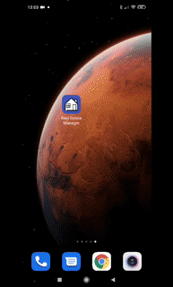
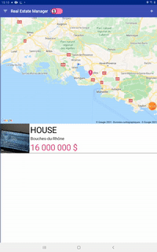
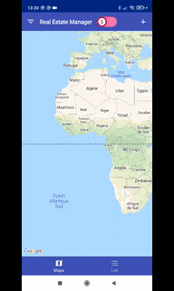
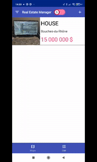
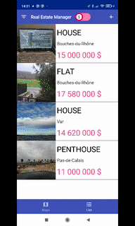
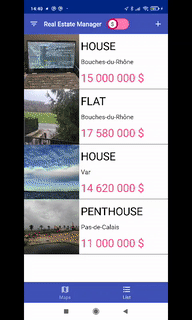

# Real Estate Manager

 ## 1. Requierements.

+ **Compile Sdk Version :** 29.
+ **Min Sdk Version :** 19.
+ **JavaVersion :** 1_8.

## 2. Preview.

### RealEstateAgent presentation.

+ presentation of the app structure and more : https://slides.com/justanothercoder/deck-bb2c2f
  
### Made for tablette and phone, support Portrait and Landscape.

### Add new property.

### Update property.

### Interactive map.

### Filter.

### Set property sold.

 ## Preview, principal fonctionalities :
  + Manage your real estate for sale.
  + Add new property.
  + Add media from gallery, or your device's camera.
  + Update property or set them sold.
  + Show properties on maps.
  + Filter property on multi criteria values.
  

## 3. Work done :

### Clean architecture.
+ Single activity.
+ Multi module.
+ DI with Hilt.
+ Reactive programming with RxJava.

### Room.
+ Repository and Dao pattern.
+ View model and Live data
+ Http calls with retrofit.

### Other.
+ SOLID approach.
+ Navigation with navigation component.
+ Custom view, layout construction.
+ Use Maps, Places, Geocoding, Maps Static.